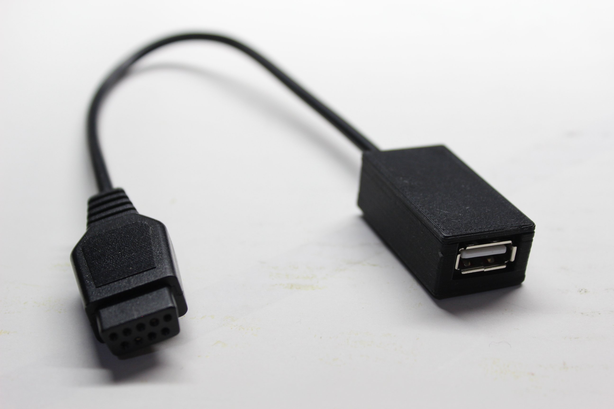
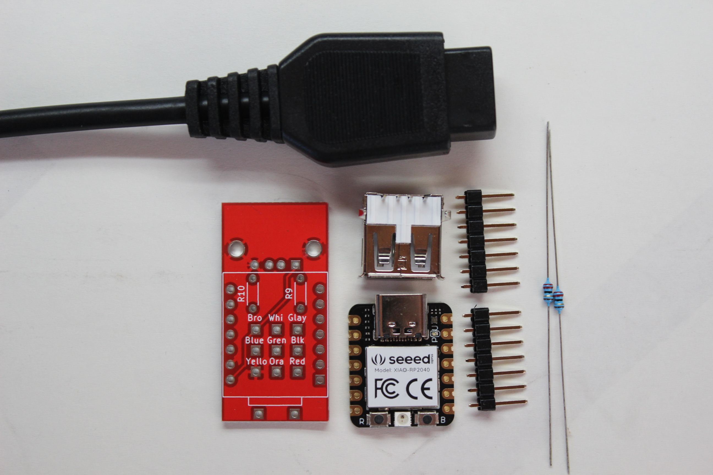
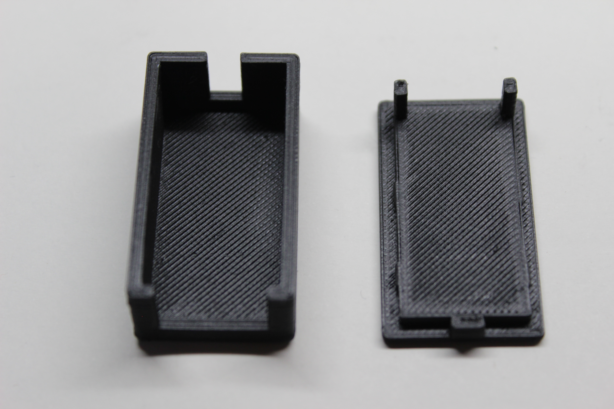
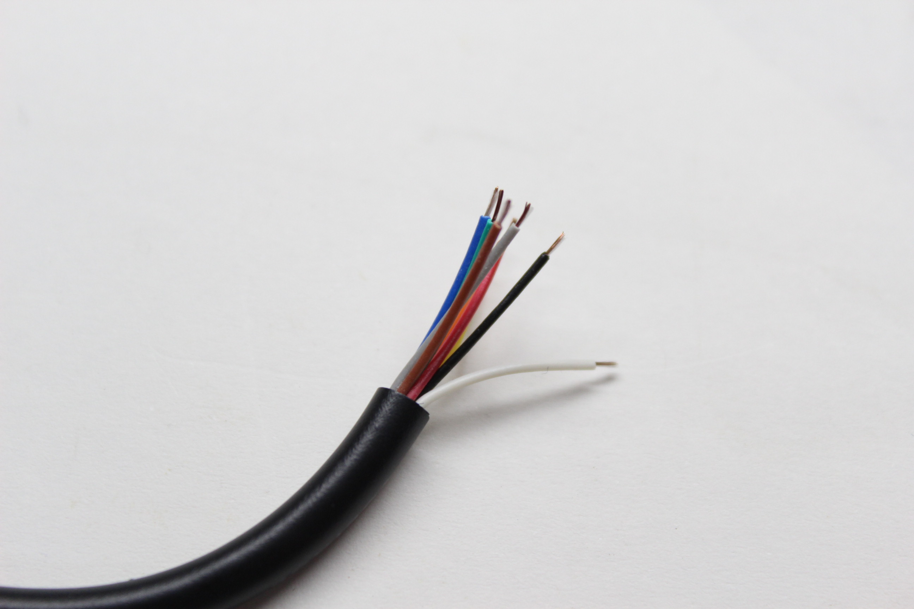
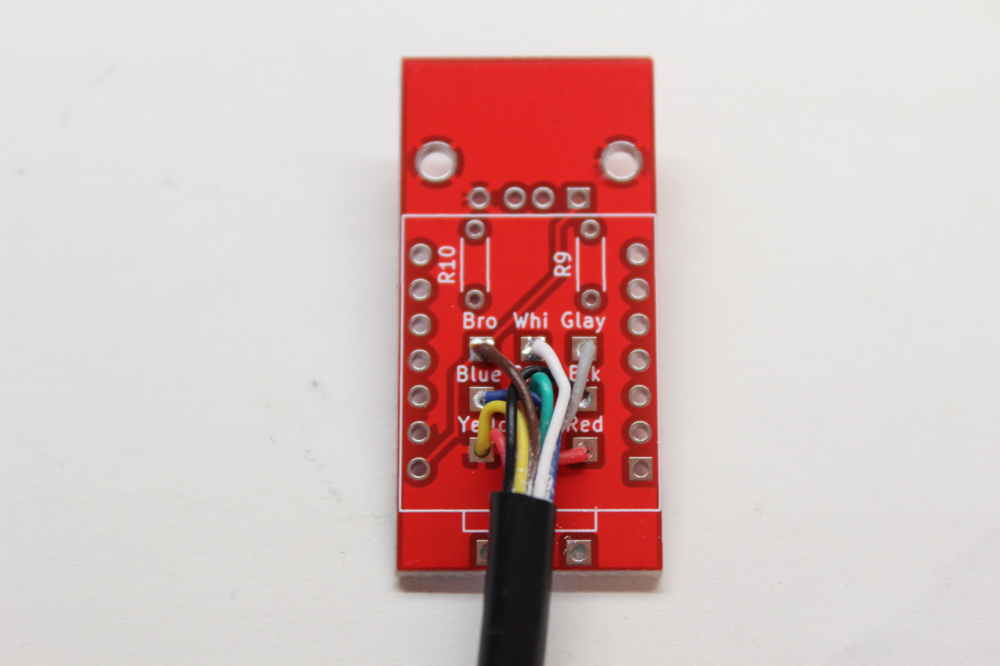
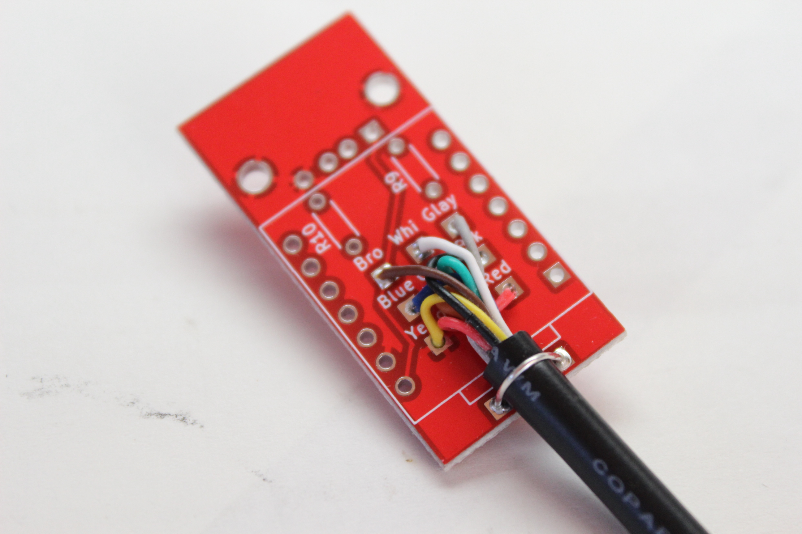
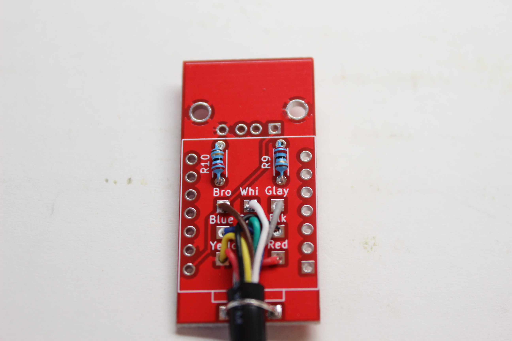
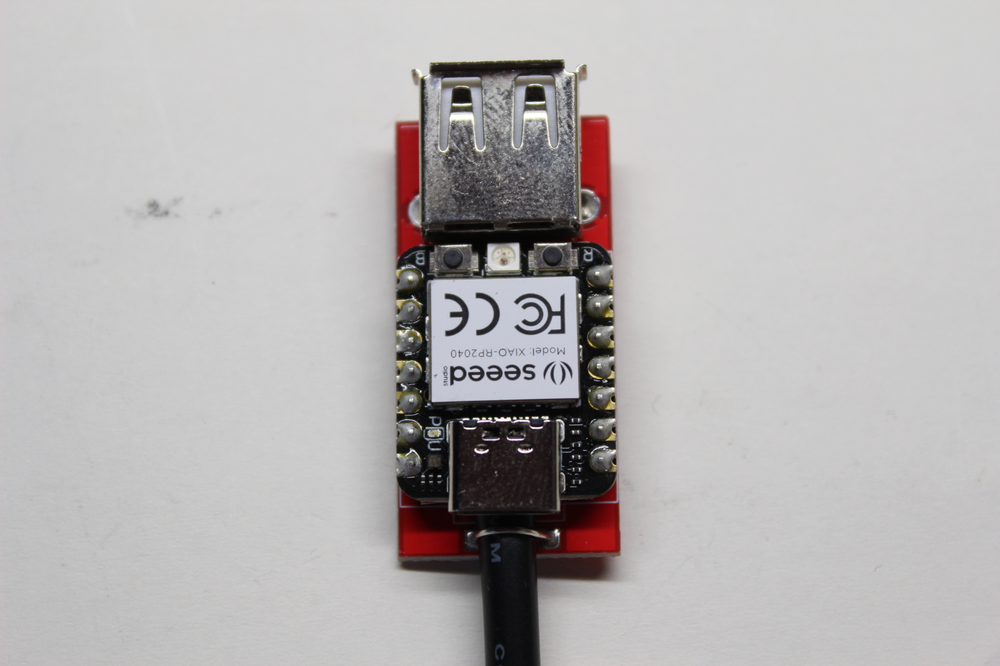
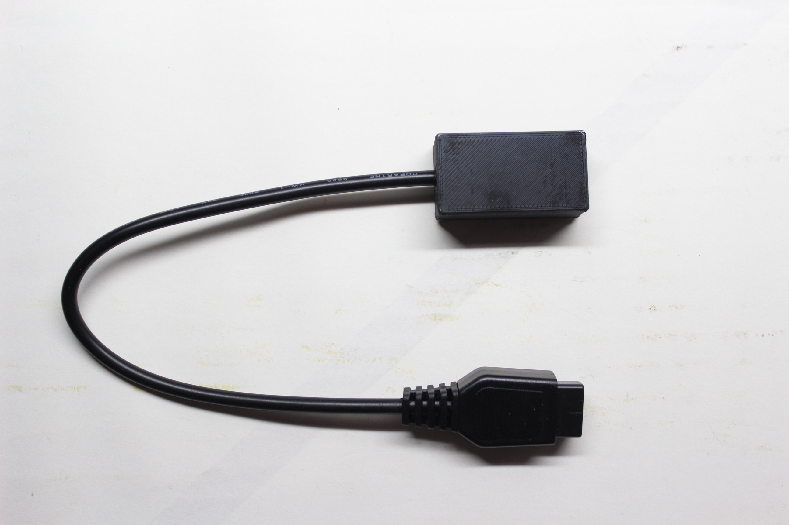

# MsxUsbMouseConverter
MSX USBマウス変換器  
MSX USB Mouse converter  

## 概要
- PC用USBマウスをMSXのインテリジェントマウスとして使用するための変換器です
- 組み立てにはハンダ付けが必要です
- ケースは購入可能です、3Dプリンター用モデルも無料提供しています
- サポートはありません

## 動作
- 本機はMSX用マウスモードのみで動作します。モード切替はありません

- ホイール上下で感度(解像度)が5段階変化します

## 動作検証
- 以下のソフトで問題なく動作することを確認しました
  - 秘録 首斬り館 〜逐電屋藤兵衛〜（マウス）
  - スーパーグラフィックツール ダ・ビンチ（マウス）
  - 王家の谷（ジョイスティック）

- 以下のマウスで動作を確認しています
  - iBuffalo BSMRW21 USB無線マウス
  - Logicool M705 USB無線マウス

- 電力消費の大きなLED付き有線マウスは動作しない可能性があります

## キット内容
- 変換基板 x1
- マイコン基板 (ソフトウェア書込み済) x1
- USB Type A メスコネクタ x1
- 抵抗 22Ω x2
- ピンヘッダ x2
- D-SUB 9ピンコントローラ用ケーブル x1
- ケース (オプション) 上下組 x1
  ※お届けする商品は画像のものと異なる場合があります

  
   

## 組立方法
- D-SUB 9ピンコントローラ用ケーブルの先端を剥き予備ハンダしておきます

  

- 変換基板のシルクに書かれた色に合わせて9本のケーブルをハンダ付けします

- 部品の足などを使用してケーブルの抜け止めをハンダ付けします（キットには含まれません）
  - シルクの線を目安に黒い被膜がマイコン基板に干渉しないようにします

- 抵抗2本を取り付けます

- USBコネクタとマイコン基板を取り付けます

- 裏面に飛び出したピンヘッダやコネクタの足はできるだけ短くカットします
  - ケースに入れない場合は絶縁テープなどを貼りショートしないようにします

- ケースに入れます

## ケースのプリント用データ

https://github.com/Retro-Do-MSX/MsxUsbMouseConverter/blob/main/Models/Bottom%20MSX%20USB%20Mouse%20Converter%20case.stl
https://github.com/Retro-Do-MSX/MsxUsbMouseConverter/blob/main/Models/Upper%20MSX%20USB%20Mouse%20Converter%20case.stl
